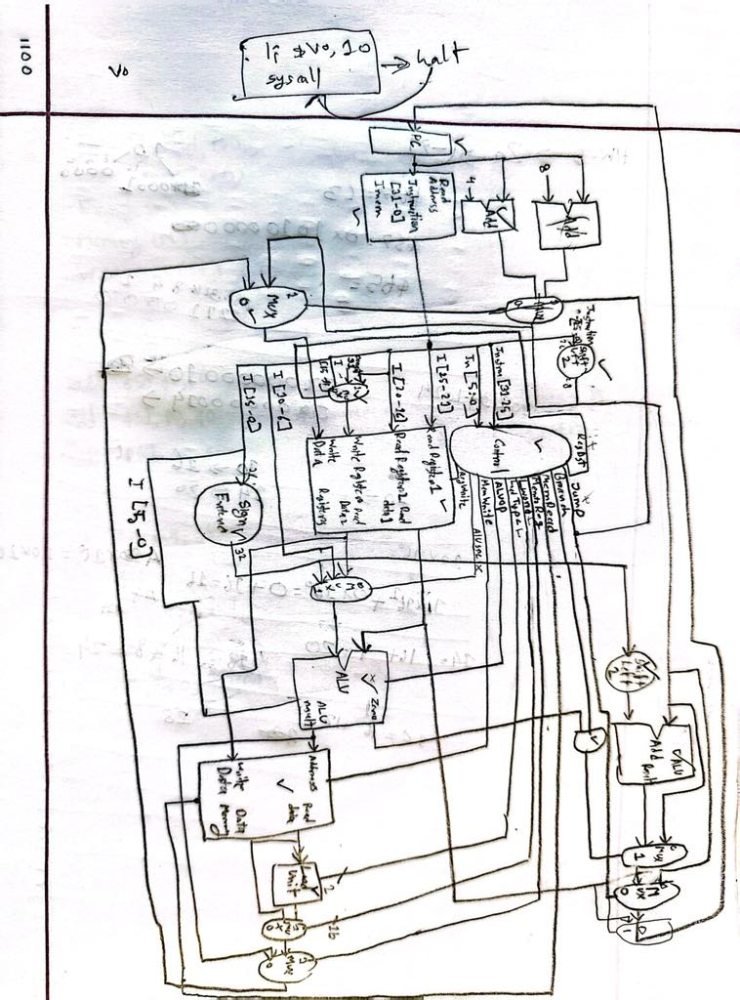

# 🖥️ Single-Cycle MIPS Processor (VHDL)

> A VHDL-based single-cycle MIPS processor built for CprE 381. It supports a basic instruction set and runs each instruction in one clock cycle.

---

## 🚀 Overview

This is a simple processor built in VHDL. It runs MIPS assembly instructions using:
- Instruction Fetch (IF)
- Instruction Decode (ID)
- Execute (EX)
- Memory Access (MEM)
- Write Back (WB)

It uses modular design and testbenches to verify correctness.

---

## 🧱 Architecture

Below is a diagram of the processor (replace with your own image):



---

## ✅ Features

- VHDL RTL implementation
- Supports basic MIPS instructions
- Control Unit and Datapath separation
- Works with simulated memory
- Fully tested with testbenches

---

## 📁 File Overview

```
.
├── src/               # VHDL source files
├── test/              # Testbench files
├── mips           
|--- Proj1_report 
|--- Proj1_control_signals(1)
```

---

## 🔧 How to Run

Use a VHDL simulator like **ModelSim** or **QuestaSim**:
1. Compile all `.vhdl` files
2. Run the testbench
3. Check waveform and output

---

## 🛠️ Skills Used

- VHDL hardware design
- CPU datapath and control design
- Assembly instruction decoding
- Simulation and debugging

---

## ✍️ Author

**Rafat Momin
**Tyler Kloser
Computer Engineering @ Iowa State University  
📧 rafatmom@iastate.edu  
🌐 [https://www.linkedin.com/in/rafatmomin/]
